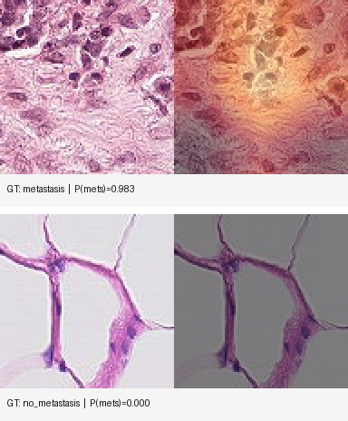
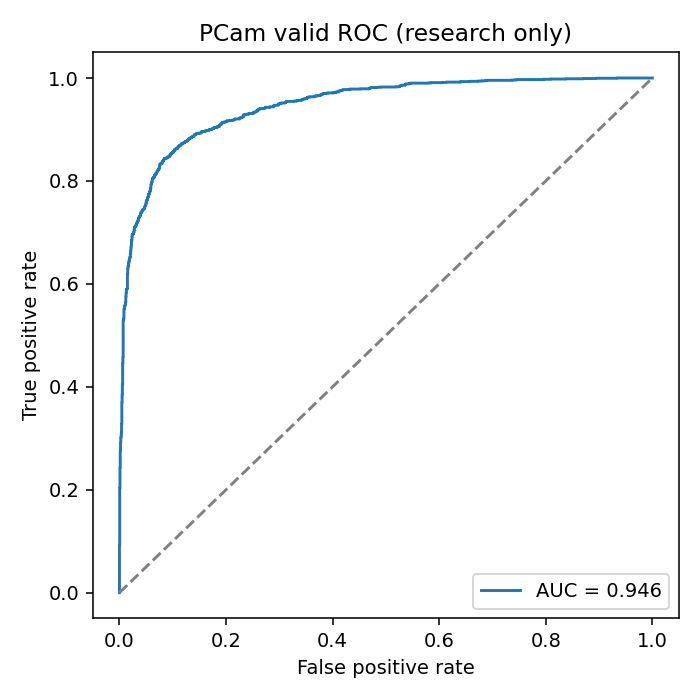
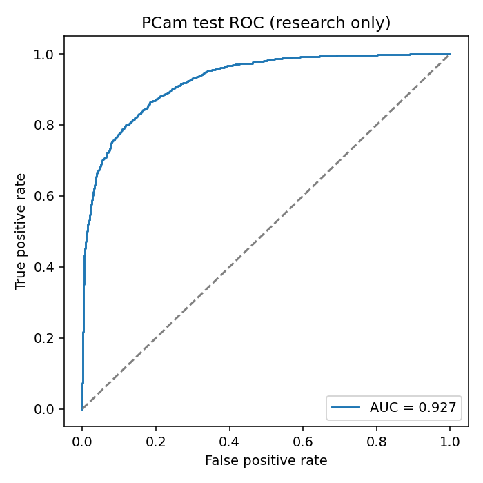
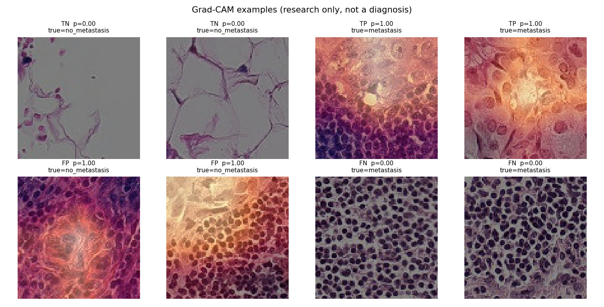

# PatchMets-XAI

*(repository: `pcam-mets-explain`)*

**Research demo — not a diagnosis.**  
**PatchMets-XAI** = **Patch**-level **met**astasis detector with e**X**plainable **AI** (Grad-CAM).

A small model looks at one **tiny lymph-node histology patch** and estimates whether it contains **metastasis**. It also draws a heatmap of the pixels it used.

This is **patch-level**, not whole-slide analysis. One square is not a patient result.

Honest limits and leakage notes: [`docs/MODEL_CARD.md`](docs/MODEL_CARD.md).

<p align="center">
  
</p>

<p align="center"><em>Left: original 96×96 patch · Right: Grad-CAM overlay · Labels are ground truth from PatchCamelyon validation</em></p>

## Results

Trained **ResNet18** on a balanced PCam subset (**20k train / 4k valid**, 3 epochs, GPU).

| Split | AUC | Accuracy (threshold 0.5) |
| --- | ---: | ---: |
| Validation | **0.946** | ~0.87 |
| Held-out test | **0.927** | ~0.82 |

<p align="center">
  
  
</p>

<p align="center">
  
</p>

PCam’s official splits are **WSI-disjoint** (different slides in train / valid / test). That reduces slide leakage, but this is still **not** a clinical validation.

## Quick demo (Streamlit)

Needs a trained checkpoint at `reports/checkpoints/best.pt` (not in git — train it, or copy yours from the machine where you trained).

```powershell
cd C:\Users\hp\Projects\pcam-mets-explain
python -m venv .venv
.\.venv\Scripts\Activate.ps1
pip install -e ".[app,dev]"
# CPU torch if needed:
# pip install torch torchvision --index-url https://download.pytorch.org/whl/cpu
streamlit run app/streamlit_app.py
```

Try the labeled example patches in [`reports/demo_samples/`](reports/demo_samples/) (filenames include the ground truth).

On Linux:

```bash
cd /path/to/pcam-mets-explain
source .venv/bin/activate
pip install -e ".[app,dev]"
streamlit run app/streamlit_app.py
```

## Repository layout

| Path | Role |
| --- | --- |
| `src/pcam_mets_explain/` | Download, train, evaluate, Grad-CAM, single-patch inference |
| `app/streamlit_app.py` | Upload → P(metastasis) + heatmap |
| `reports/demo_samples/` | Small PNGs with known labels for testing the app |
| `docs/figures/` | ROC / Grad-CAM images for this README |
| `data/` | PCam HDF5 downloads (not committed) |
| `tests/` | Lightweight unit tests |

## Reproduce the full pipeline

### 1) Environment

```powershell
pip install -e ".[dev]"
python -m pcam_mets_explain.check_env
```

### 2) Download PatchCamelyon

```bash
pip install -e ".[dev,download]"
python -m pcam_mets_explain.download          # omit --light for the full train set
python -m pcam_mets_explain.preview
```

Details: [`data/README.md`](data/README.md). Do **not** commit `data/raw`.

### 3) Train ResNet18 (GPU preferred)

```bash
pip install -e ".[train,dev]"
python -m pcam_mets_explain.train \
  --epochs 3 \
  --batch-size 64 \
  --max-train 20000 \
  --max-valid 4000
```

Use `--max-train 0 --max-valid 0` for the full published splits.  
Outputs: `reports/checkpoints/best.pt`, `reports/metrics.json`.

### 4) Evaluation and Grad-CAM

```bash
python -m pcam_mets_explain.explain --split valid --max-samples 4000
python -m pcam_mets_explain.explain --split test --max-samples 4000
```

### 5) Demo app

```bash
streamlit run app/streamlit_app.py
```

## Disclaimer

Research and education only. **Not** a medical device. **Not** for diagnosis or treatment decisions. PatchCamelyon has its own data terms; do not redistribute the dataset from this repository.

## License

MIT (code). PCam data remains under its original terms.
